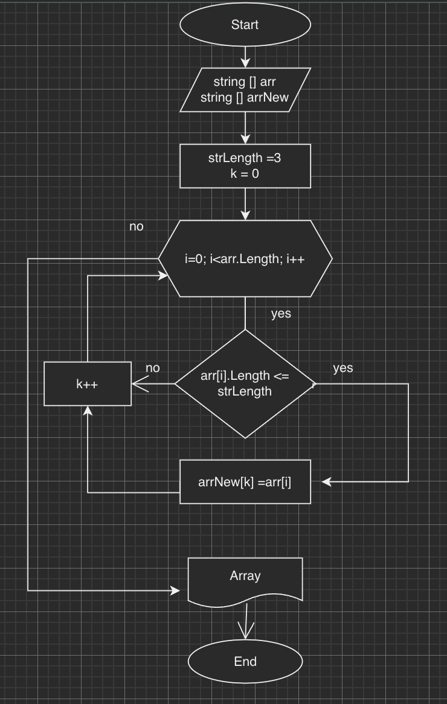

# Условие задачи: 
*Написать программу, которая из имеющегося массива строк формирует массив из строк, длина которых меньше либо равно 3 символа. Первоначальный массив можно ввести с клавиатуры, либо задать на старте выполнения алгоритма. При решении не рекомендуется пользоваться коллекциями, лучше обойтись исключительно массивами.*

[“Hello”, “2”, “world”, “:-)”] → [“2”, “:-)”]
[“1234”, “1567”, “-2”, “computer science”] → [“-2”]
[“Russia”, “Denmark”, “Kazan”] → []

## Блок - схема алгоритма заданной задачи: 

## Поэтапное решение задачи:
1. Инициализация массива заполненный на старте выполнения алгоритма
2. Выделение памяти под новый/ожидаемый массив
3. Написание метода для заполнения и формирования нового массива (С помощью цикла for)
4. Написание метода вывода массива

## Путь к написанной программе 
Task/ Solution/Program.cs